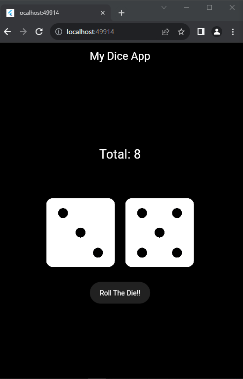

# Flutter Dice App

## Overview
This Flutter Dice App is a simple application that simulates rolling a pair of dice. With just a tap of a button, users can see the result of rolling two dice displayed on the screen. It's a fun and easy way to generate random numbers for games, decision-making, or any other purpose where randomization is needed.

## Screenshot


## Features
- Simulates rolling a pair of dice.
- Generates random numbers between 1 and 6 for each die.
- User-friendly interface with a single button for rolling the dice.
- Instantaneous response for quick and smooth user experience.


## Getting Started
To use this app, follow these steps:

1. Ensure you have Flutter SDK installed on your machine. If not, refer to the official Flutter documentation for installation instructions: [Flutter Documentation](https://flutter.dev/docs/get-started/install)

2. Clone this repository to your local machine:
```
git clone https://github.com/adebola-duf/my_dice_app.git
```

3. Navigate to the project directory:
```
cd my_dice_app
```

4. Run the app on an emulator or a physical device:
```
flutter run
```

5. Once the app is running, tap the "Roll Dice" button to see the result of rolling two dice.

## Contributing
Contributions are welcome! If you'd like to contribute to this project, please follow these steps:

1. Fork the repository on GitHub.
2. Clone your forked repository to your local machine.
3. Create a new branch to work on.
4. Make your changes and test thoroughly.
5. Commit your changes with descriptive commit messages.
6. Push your changes to your forked repository.
7. Submit a pull request to the original repository.

## Credits
This app was created by Odufuwa Adebola AKA Bolexyro.
